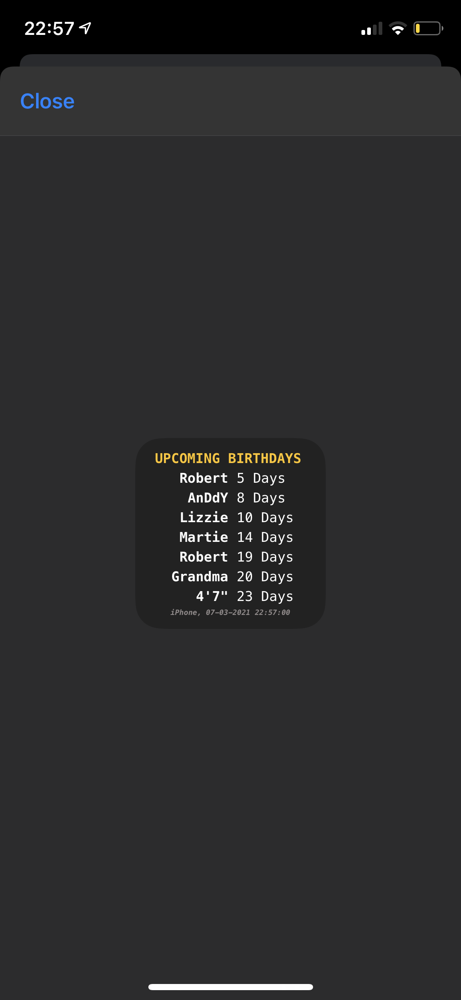

# SCRIPTABLE SCRIPT: daysUntilBirthday
- Script for the iOS App Scriptable.
- Forked from lwitzani's original [daysUntilBirthday](https://github.com/lwitzani/daysUntilBirthday), adapted for small widget with some additional colour, font options.
- Up to 8 people of your contacts are shown simultaneously, displaying how many days are left until their Birthday.
- Contacts are sorted by how far away their birthday is (nearest first).

## How to Use
### Mode 1 (Default): Chosen Contacts Only
In the iOS Contacts app, edit the contacts you want to be visible in this widget. To do this:
1. You need to set up an additional 'date' field in your contact and give the date the label '**daysUntilBirthday**'.
2. Run the script initially in the Scriptable app to create a .json file in iCloud containing contact information for faster access.
3. When you add new contacts via the label, run the script again in the app to update the .json! This makes the changes visible in *iCloud Mode*.
4. When setting the script up as **widget**, use the ***smallest presentation mode*** and ***provide the parameter 'iCloud'*** (without the ' ').
- If contacts have a nickname set, the nickname will be chosen.
- If the name contains a space character, only the part before the first space is used (in case of a nickname like 'Julian ❤️' the name in this widget will be 'Julian').
- 

### Mode 2: Show All Contacts with a Birthday Configured
- Set the variable '**showAllContacts**' to '*true*' or provide the parameter '*showAll*' in widget mode to show all contacts that have a birthday in the regular birthday field configured.

### iCloud Mode:
- Set the variable '**useIcloud**' to true or provide the parameter '*iCloud*' in widget mode to never recalculate which contacts are shown again.
	- If false -> everytime the contacts are scanned.
	- If true -> contacts are not scanned and last used contacts are used again.

## Widget Setup
- When using parameter '*iCloud*' the contacts are not scanned and the source at the bottom changes to '*iCloud*'.
- When using parameter '*showAll*' (without using parameter '*iCloud*') all contacts with birthdays are shown.
- *Note*, if the last configuration was empty and next one is '*iCloud,showAll*' then because of *iCloud Mode* (all previous found contacts are used again) the '*showAll*' parameter will not have any effect, since the default mode is *Mode 1* (only show selected contacts).

## Configuration Settings
### Language
- You can easily edit the parameter at the top of the script to show the text you like.
- Example is in English.

### Text Formatting
- Text formatting options are available and can be changed in the **SETTINGS** section of the script.
	- The default font is 'Menlo-regular', and 'Menlo-bold'. More font options are available [here](http://iosfonts.com); it is recommended to use a mono-space font such as 'Courier', or 'Courier New'.
	- The default font size for the text is 11, with the exception of the **updated info** which is size 6.
	- Colours can be adjusted by inputting HEX values - for inspiration I use [Coolors.co](https://coolors.co).
- '**contactsToShow**' with a bit of tweaking of the font settings it's possible to fit more than the advertised 8 in the widget, but for good legibility at a glance, I'd recommend sticking to the default *7*.
- '**lineSpace**' dictates how much padding there is between the text rows. Default is *3*.
- '**lineLength**' dictates the padding on the left side of the widget. Default is *9*.
- ***Advanced***, it is possible to display the *date* of the Birthday instead of the *days until* by changing the '**birthdayDateFormat**' from *1* to *2*. In doing this the default formatting will look a little weird and you'll need to adjust the '**lineLength**' parameter to a value of 7 to get things centered again.

